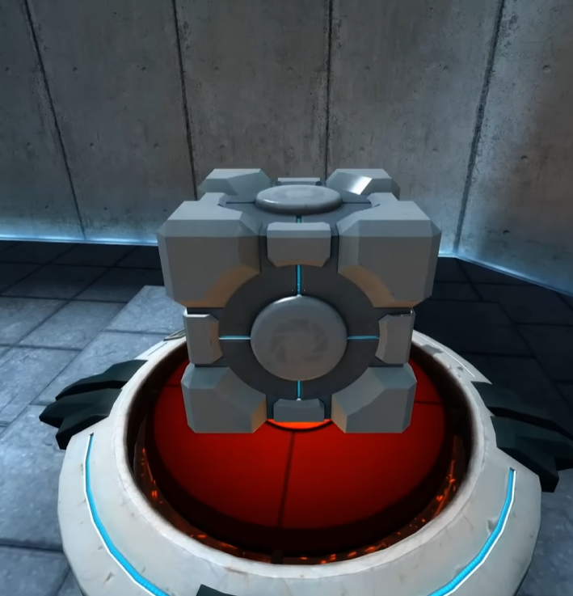
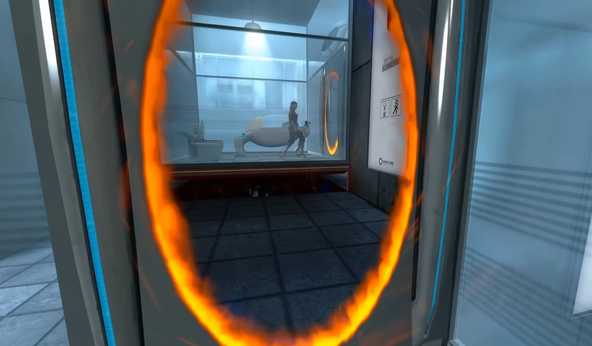
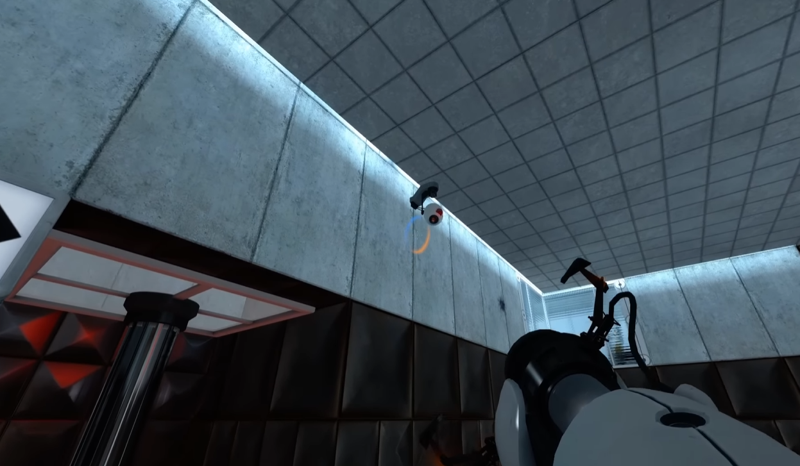

# Especificação da Implementação

> [!CAUTION]
> - Você <ins>**não pode utilizar ferramentas de IA para escrever esta
>   especificação**</ins>

## Integrantes da dupla

- **Aluno 1 - Nome**: Gabriel Pieruccini Knopp
- **Aluno 1 - Cartão UFRGS**: 00594975

- **Aluno 2 - Nome**: Tobias Cadoná Marion
- **Aluno 2 - Cartão UFRGS**: 00590278

## Detalhes do que será implementado

- **Título do trabalho**: Portal 3 - FANMADE
- **Parágrafo curto descrevendo o que será implementado**: O projeto implementa uma prova de conceito inspirada em Portal, utilizando OpenGL para criar um ambiente 3D interativo. O usuário poderá explorar a cena, manipular objetos e usar portais para resolver um puzzle simples de duas fases. A aplicação integra conceitos como transformações, câmeras, iluminação e colisões em tempo real.

## Especificação visual

### Vídeo - Link

> [!IMPORTANT]
> - Coloque aqui um link para um vídeo que mostre a aplicação gráfica
>   de referência que você vai implementar. **Sua implementação deverá
>   ser o mais parecido possível com o que é mostrado no vídeo (mais
>   detalhes abaixo).**
> - **Você não pode escolher como referência: (1) algum trabalho realizado
>   por outros alunos desta disciplina, em semestres anteriores. (2) Minecraft.**
> - Por exemplo, você pode colocar um vídeo de um jogo que você gosta,
>   e seu trabalho final será uma re-implementação do jogo.
> - O vídeo pode ser um link para YouTube, Google Drive, ou arquivo mp4 dentro
>   do próprio repositório. Mas, garanta que qualquer um tenha
>   permissão de acesso ao vídeo através deste link.

Link do vídeo: https://www.youtube.com/watch?v=wA82CD9YFG0

### Vídeo - Timestamp

> [!IMPORTANT]
> - Coloque aqui um **intervalo de ~30 segundos** do vídeo acima, que
>   será a base de comparação para avaliar se o seu trabalho final
>   conseguiu ou não reproduzir a referência.

Seguem dois intervalos, para representar os distintos elementos que serão abordados.

Primeiro:

- **Timestamp inicial**: 1:20
- **Timestamp final**: 1:26

Segundo:

- **Timestamp inicial**: 19:30
- **Timestamp final**: 19:45

### Imagens

> [!IMPORTANT]
> - Coloque aqui **três imagens** capturadas do vídeo acima, que você
>   irá usar como ilustração para as explicações que vêm abaixo.

## Especificação textual

Para cada um dos requisitos abaixo (detalhados no [Enunciado do Trabalho final - Moodle](https://moodle.ufrgs.br/mod/assign/view.php?id=6018620)), escreva um parágrafo **curto** explicando como este requisito será atendido, apontando itens específicos do vídeo/imagens que você incluiu acima que atendem estes requisitos.

### Malhas poligonais complexas
Serão malhas poligonais complexas os próprios modelos das caixas, da arma do portal, do personagem, do terreno/cenário, entre outros objetos que possam ser utilizados na fase.

### Transformações geométricas controladas pelo usuário
Mover as caixas e andar serão transformações geométricas que serão controladas pelo usuário, além de indiretamente os próprios portais, já que eles geram transformações geométricas e são posicionados pelo usuário.

### Diferentes tipos de câmeras
Como mencionado, a câmera do personagem será a primeira, sendo controlada pelo mouse, e a segunda câmera será uma look-at travada no personagem (como se fosse uma câmera de segurança assistindo o jogador em 3° pessoa, que costuma ficar no canto do teto). Os portais também utilizarão câmeras para renderizar a imagem através deles de forma correta.

### Instâncias de objetos
As nossas fases poderão conter mais de uma instância do objeto "botão" e, portanto, mais de uma instância de "caixa" posicionadas pelo ambiente. Além disso, ao criar um novo portal em uma localização distinta, a instância do portal na localização antiga é removida e um novo portal é instanciado na nova localização.

### Testes de intersecção
Para garantir que o personagem não atravesse o cenário ou algum objeto, serão necessários testes de colisão entre personagem-parede ("parede" inclui chão e teto), personagem-"câmera de segurança" e personagem-caixa. Para garantir que nenhum objeto interagível (que dê para mudar de posição) entre dentro de outro, precisaremos também de testes de colisão entre caixa-caixa, caixa-parede, caixa-"câmera de segurança" e caixa-botão (que também deve ser usado para garantir condição de "botão pressionado"). Por fim, para colocar um portal em uma superfície, precisamos de testes de colisão do "portal disparado"-parede.

### Modelos de Iluminação em todos os objetos
A cena deverá conter uma ou mais fontes de iluminação (lâmpadas pelas salas) e, portanto, podemos iluminar os objetos de acordo.

### Mapeamento de texturas em todos os objetos
Caixas, personagem, paredes (especialmente para diferenciar qual pode possuir um portal nela e qual não), chão, teto e outros objetos que serão usados devem possuir texturas, as quais estão públicas na internet.

### Movimentação com curva Bézier cúbica
Vamos utilizar essa técnica de movimentação em objetos que servirão para enriquecer o cenário, como a própria câmera de segurança que fica no canto da sala (como se ela estivesse mexendo para os lados conforme o tempo passa) ou uma torreta que fique se mexendo fora do alcance do jogador.

### Animações baseadas no tempo ($\Delta t$)
Todas as movimentações dos objetos e do personagem irão depender do tempo, já que possuem gravidade e, portanto, caem no chão. Além disso, efeitos nos portais ou outros objetos poderão ser animados em função do tempo.

## Limitações esperadas

> [!IMPORTANT]
> - Coloque aqui uma lista de detalhes visuais ou de interação que
>   aparecem no vídeo e/ou imagens acima, mas que você **não pretende
>   implementar** ou que você **irá implementar parcialmente**.
> - Para cada item, **explique por que** não será implementado ou por
>   que será implementado parcialmente.

- Um dos elementos que não iremos implementar (ou implementar bem parcialmente) será a animação visual do personagem e de outros elementos da cena (como o personagem "mexendo as pernas" ao andar ou o cubo sendo "despejado" do "dispenser" - pretendemos deixar o cubo ali na cena desde o início). Faremos isso pois esse tipo de animação aumentaria muito a complexidade do projeto, sem agregar no aprendizado esperado da cadeira.
- Também não iremos implementar a barreira que "destrói" os objetos de uma fase, visto que ela não seria utilizada para a nossa demo (não planejamos destruir os objetos).
- Por fim, não iremos seguir à risca a interface do jogo (HUD, opções de configuração do jogo, menu de pause...), pois não é o foco do projeto. Ainda planejamos implementar uma interface, mas sem a preocupação de ser idêntica à do jogo.
